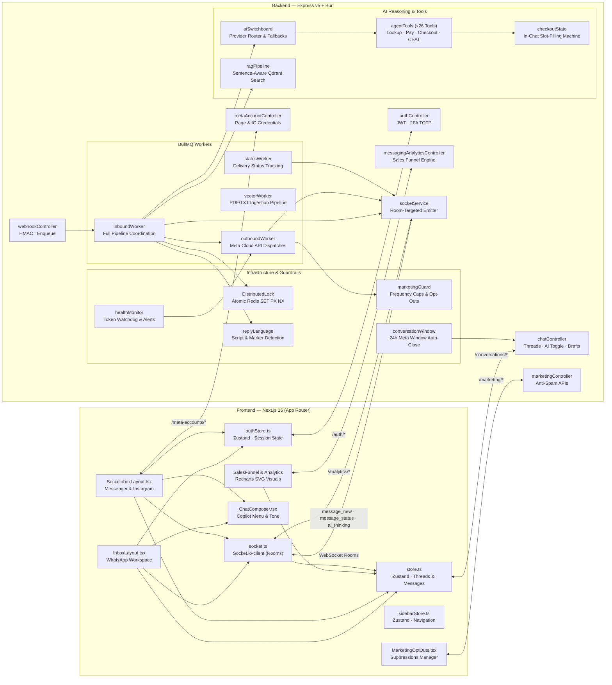

# Component Interactions Diagram

```mermaid
graph LR
    subgraph FE["Frontend — Next.js 16 (App Router)"]
        AUTH_STORE["authStore.ts\nZustand · Session State"]
        INBOX_STORE["store.ts\nZustand · Threads & Messages"]
        SIDEBAR_STORE["sidebarStore.ts\nZustand · Navigation"]
        SOCKET_CLIENT["socket.ts\nSocket.io-client (Rooms)"]
        IL["InboxLayout.tsx\nWhatsApp Workspace"]
        SIL["SocialInboxLayout.tsx\nMessenger & Instagram"]
        CC["ChatComposer.tsx\nCopilot Menu & Tone"]
        DASH_UI["SalesFunnel & Analytics\nRecharts SVG Visuals"]
        MKTG_UI["MarketingOptOuts.tsx\nSuppressions Manager"]
    end

    subgraph BE["Backend — Express v5 + Bun"]
        AUTH_C["authController\nJWT · 2FA TOTP"]
        CHAT_C["chatController\nThreads · AI Toggle · Drafts"]
        META_AC_C["metaAccountController\nPage & IG Credentials"]
        WH_C["webhookController\nHMAC · Enqueue"]
        MKTG_C["marketingController\nAnti-Spam APIs"]
        ANALYTICS_C["messagingAnalyticsController\nSales Funnel Engine"]

        subgraph INFRA["Infrastructure & Guardrails"]
            LOCK["DistributedLock\nAtomic Redis SET PX NX"]
            LANG["replyLanguage\nScript & Marker Detection"]
            MGUARD["marketingGuard\nFrequency Caps & Opt-Outs"]
            HEALTH["healthMonitor\nToken Watchdog & Alerts"]
            WINDOW["conversationWindow\n24h Meta Window Auto-Close"]
        end

        subgraph AI["AI Reasoning & Tools"]
            AI_SW["aiSwitchboard\nProvider Router & Fallbacks"]
            RAG_P["ragPipeline\nSentence-Aware Qdrant Search"]
            AGENT_TOOLS["agentTools (x26 Tools)\nLookup · Pay · Checkout · CSAT"]
            CHECKOUT["checkoutState\nIn-Chat Slot-Filling Machine"]
        end

        subgraph WORKERS["BullMQ Workers"]
            IW["inboundWorker\nFull Pipeline Coordination"]
            OW["outboundWorker\nMeta Cloud API Dispatches"]
            VW["vectorWorker\nPDF/TXT Ingestion Pipeline"]
            SW["statusWorker\nDelivery Status Tracking"]
        end

        SOCK_S["socketService\nRoom-Targeted Emitter"]
    end

    %% Frontend Internal
    IL & SIL --> AUTH_STORE & INBOX_STORE & SOCKET_CLIENT
    IL & SIL --> CC
    DASH_UI --> INBOX_STORE

    %% Frontend <-> Backend HTTP
    AUTH_STORE <-->|"/auth/*"| AUTH_C
    INBOX_STORE <-->|"/conversations/*"| CHAT_C
    SIL <-->|"/meta-accounts/*"| META_AC_C
    DASH_UI <-->|"/analytics/*"| ANALYTICS_C
    MKTG_UI <-->|"/marketing/*"| MKTG_C

    %% Real-Time WebSocket
    SOCKET_CLIENT <-->|"WebSocket Rooms"| SOCK_S
    SOCK_S -->|"message_new · message_status · ai_thinking"| SOCKET_CLIENT
    SOCKET_CLIENT --> INBOX_STORE

    %% Inbound Processing Graph
    WH_C --> IW
    IW --> LOCK
    IW --> LANG
    IW --> RAG_P
    IW --> AI_SW
    AI_SW --> AGENT_TOOLS
    AGENT_TOOLS --> CHECKOUT
    IW --> OW
    OW --> MGUARD
    IW --> SOCK_S
    OW --> SOCK_S
    SW --> SOCK_S

    %% Housekeeping & Monitoring
    HEALTH --> OW
    WINDOW --> CHAT_C
```
