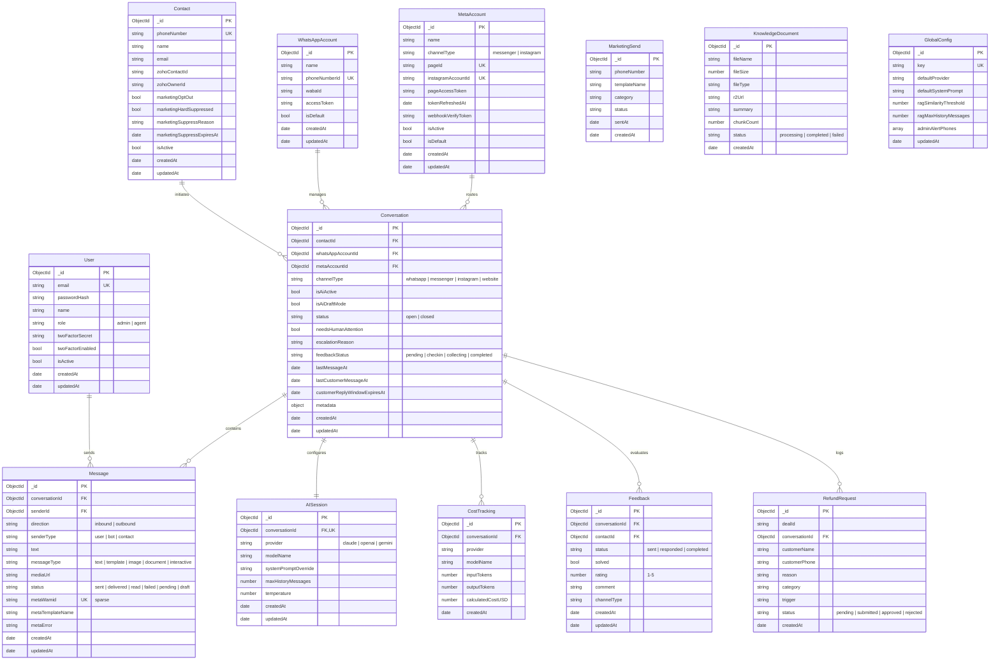

# Database Relationships Diagram

```mermaid
erDiagram
    User {
        ObjectId _id PK
        string email UK
        string passwordHash
        string name
        string role "admin | agent"
        string twoFactorSecret
        bool twoFactorEnabled
        bool isActive
        date createdAt
        date updatedAt
    }

    Contact {
        ObjectId _id PK
        string phoneNumber UK
        string name
        string email
        string zohoContactId
        string zohoOwnerId
        bool marketingOptOut
        bool marketingHardSuppressed
        string marketingSuppressReason
        date marketingSuppressExpiresAt
        bool isActive
        date createdAt
        date updatedAt
    }

    MetaAccount {
        ObjectId _id PK
        string name
        string channelType "messenger | instagram"
        string pageId UK
        string instagramAccountId UK
        string pageAccessToken
        date tokenRefreshedAt
        string webhookVerifyToken
        bool isActive
        bool isDefault
        date createdAt
        date updatedAt
    }

    WhatsAppAccount {
        ObjectId _id PK
        string name
        string phoneNumberId UK
        string wabaId
        string accessToken
        bool isDefault
        date createdAt
        date updatedAt
    }

    Conversation {
        ObjectId _id PK
        ObjectId contactId FK
        ObjectId whatsAppAccountId FK
        ObjectId metaAccountId FK
        string channelType "whatsapp | messenger | instagram | website"
        bool isAiActive
        bool isAiDraftMode
        string status "open | closed"
        bool needsHumanAttention
        string escalationReason
        string feedbackStatus "pending | checkin | collecting | completed"
        date lastMessageAt
        date lastCustomerMessageAt
        date customerReplyWindowExpiresAt
        object metadata
        date createdAt
        date updatedAt
    }

    Message {
        ObjectId _id PK
        ObjectId conversationId FK
        ObjectId senderId FK
        string direction "inbound | outbound"
        string senderType "user | bot | contact"
        string text
        string messageType "text | template | image | document | interactive"
        string mediaUrl
        string status "sent | delivered | read | failed | pending | draft"
        string metaWamid UK "sparse"
        string metaTemplateName
        string metaError
        date createdAt
        date updatedAt
    }

    AISession {
        ObjectId _id PK
        ObjectId conversationId FK, UK
        string provider "claude | openai | gemini"
        string modelName
        string systemPromptOverride
        number maxHistoryMessages
        number temperature
        date createdAt
        date updatedAt
    }

    CostTracking {
        ObjectId _id PK
        ObjectId conversationId FK
        string provider
        string modelName
        number inputTokens
        number outputTokens
        number calculatedCostUSD
        date createdAt
    }

    MarketingSend {
        ObjectId _id PK
        string phoneNumber
        string templateName
        string category
        string status
        date sentAt
        date createdAt
    }

    RefundRequest {
        ObjectId _id PK
        string dealId
        ObjectId conversationId FK
        string customerName
        string customerPhone
        string reason
        string category
        string trigger
        string status "pending | submitted | approved | rejected"
        date createdAt
    }

    Feedback {
        ObjectId _id PK
        ObjectId conversationId FK
        ObjectId contactId FK
        string status "sent | responded | completed"
        bool solved
        number rating "1-5"
        string comment
        string channelType
        date createdAt
        date updatedAt
    }

    KnowledgeDocument {
        ObjectId _id PK
        string fileName
        number fileSize
        string fileType
        string r2Url
        string summary
        number chunkCount
        string status "processing | completed | failed"
        date createdAt
    }

    GlobalConfig {
        ObjectId _id PK
        string key UK
        string defaultProvider
        string defaultSystemPrompt
        number ragSimilarityThreshold
        number ragMaxHistoryMessages
        array adminAlertPhones
        date updatedAt
    }

    Contact ||--o{ Conversation : "initiates"
    WhatsAppAccount ||--o{ Conversation : "manages"
    MetaAccount ||--o{ Conversation : "routes"
    Conversation ||--o{ Message : "contains"
    User ||--o{ Message : "sends"
    Conversation ||--|| AISession : "configures"
    Conversation ||--o{ CostTracking : "tracks"
    Conversation ||--o{ Feedback : "evaluates"
    Conversation ||--o{ RefundRequest : "logs"
```
