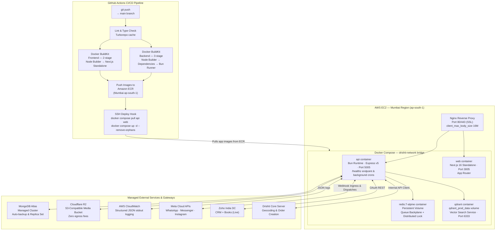

# Deployment Architecture Diagram

```mermaid
graph TB
    subgraph CICD["GitHub Actions CI/CD Pipeline"]
        direction LR
        PUSH["git push\n→ main branch"]
        LINT["Lint & Type Check\nTurborepo cache"]
        BUILD_API["Docker BuildKit\nBackend — 3-stage\nNode Builder → Dependencies → Bun Runner"]
        BUILD_WEB["Docker BuildKit\nFrontend — 2-stage\nNode Builder → Next.js Standalone"]
        ECR["Push Images to\nAmazon ECR\n(Mumbai ap-south-1)"]
        SSH["SSH Deploy Hook\ndocker compose pull api web\ndocker compose up -d --remove-orphans"]

        PUSH --> LINT --> BUILD_API & BUILD_WEB --> ECR --> SSH
    end

    subgraph AWS["AWS EC2 — Mumbai Region (ap-south-1)"]
        NGINX["Nginx Reverse Proxy\nPort 80/443 (SSL)\nclient_max_body_size 16M"]

        subgraph DOCKER["Docker Compose — drishti-network bridge"]
            API["api container\nBun Runtime · Express v5 · Port 5005\n/healthz endpoint & background crons"]
            WEB["web container\nNext.js 16 Standalone · Port 3005\nApp Router"]
            REDIS_C["redis:7-alpine container\nPersistent Volume\nQueue Backplane + Distributed Lock"]
            QDRANT_C["qdrant container\nqdrant_prod_data volume\nVector Search Service · Port 6333"]
        end

        NGINX --> API & WEB
        API --> REDIS_C & QDRANT_C
    end

    subgraph MANAGED["Managed External Services & Gateways"]
        ATLAS["MongoDB Atlas\nManaged Cluster\nAuto-backup & Replica Set"]
        CF_R2["Cloudflare R2\nS3-Compatible Media Bucket\nZero egress fees"]
        CW["AWS CloudWatch\nStructured JSON stdout logging"]
        META_EXT["Meta Cloud APIs\nWhatsApp · Messenger · Instagram"]
        ZOHO_EXT["Zoho India DC\nCRM + Books (Live)"]
        DRISHTI_CORE["Drishti Core Server\nGeocoding & Order Creation"]
    end

    SSH -->|"Pulls app images from ECR"| DOCKER
    API <--> ATLAS
    API <--> CF_R2
    API <-->|"JSON logs"| CW
    API <-->|"Webhook Ingress & Dispatches"| META_EXT
    API <-->|"OAuth REST"| ZOHO_EXT
    API <-->|"Internal API Client"| DRISHTI_CORE
```
