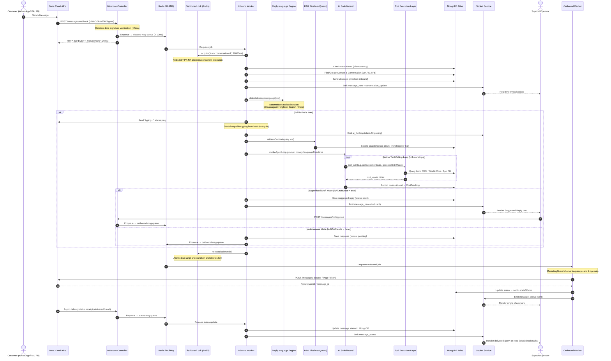

# Request Flow Diagram — Omnichannel Inbound Message Lifecycle

```mermaid
sequenceDiagram
    autonumber
    actor Customer as Customer (WhatsApp / IG / FB)
    participant Meta as Meta Cloud APIs
    participant WH as Webhook Controller
    participant Redis as Redis / BullMQ
    participant Lock as DistributedLock (Redis)
    participant IW as Inbound Worker
    participant Lang as ReplyLanguage Engine
    participant RAG as RAG Pipeline (Qdrant)
    participant Switchboard as AI Switchboard
    participant Tools as Tool Execution Layer
    participant DB as MongoDB Atlas
    participant Socket as Socket Service
    actor Agent as Support Operator
    participant OW as Outbound Worker

    Customer->>Meta: Sends Message
    Meta->>WH: POST /messages/webhook (HMAC-SHA256 Signed)
    Note over WH: Constant-time signature verification (< 5ms)
    WH->>Redis: Enqueue → inbound-msg-queue (< 10ms)
    WH-->>Meta: HTTP 200 EVENT_RECEIVED (< 20ms)

    Redis->>IW: Dequeue job
    IW->>Lock: acquire("conv:conversationId", 30000ms)
    Note over Lock: Redis SET PX NX prevents concurrent execution
    IW->>DB: Check metaWamid (Idempotency)
    IW->>DB: Find/Create Contact & Conversation (WA / IG / FB)
    IW->>DB: Save Message (direction: inbound)
    IW->>Socket: Emit message_new + conversation_update
    Socket-->>Agent: Real-time thread update

    IW->>Lang: detectMessageLanguage(text)
    Note over Lang: Deterministic script detection<br/>(Devanagari / Hinglish / English / Indic)

    alt isAiActive is true
        IW->>Meta: Send "typing..." status ping
        Note over IW: Starts keep-alive typing heartbeat (every 4s)
        IW->>Socket: Emit ai_thinking (starts UI pulsing)
        IW->>RAG: retrieveContext(query text)
        RAG->>DB: Cosine search Qdrant drishti-knowledge (> 0.3)
        IW->>Switchboard: invokeAgentLoop(prompt, history, languageDirective)

        loop Native Tool-Calling Loop (1-3 roundtrips)
            Switchboard->>Tools: tool_call (e.g. getCustomerDeals, geocodeBirthPlace)
            Tools->>DB: Query Zoho CRM / Drishti Core / App DB
            Tools-->>Switchboard: tool_result JSON
        end

        Switchboard->>DB: Record tokens & cost → CostTracking

        alt Supervised Draft Mode (isAiDraftMode = true)
            IW->>DB: Save suggested reply (status: draft)
            IW->>Socket: Emit message_new (draft card)
            Socket-->>Agent: Render Suggested Reply card
            Agent->>WH: POST /messages/:id/approve
            WH->>Redis: Enqueue → outbound-msg-queue
        else Autonomous Mode (isAiDraftMode = false)
            IW->>DB: Save response (status: pending)
            IW->>Redis: Enqueue → outbound-msg-queue
        end
    end

    IW->>Lock: release(lockHandle)
    Note over Lock: Atomic Lua script checks token and deletes key

    Redis->>OW: Dequeue outbound job
    Note over OW: MarketingGuard checks frequency caps & opt-outs
    OW->>Meta: POST /messages (Bearer / Page Token)
    Meta-->>OW: Return wamid / message_id
    OW->>DB: Update status → sent + metaWamid
    OW->>Socket: Emit message_status (sent)
    Socket-->>Agent: Render single checkmark

    Meta->>WH: Async delivery status receipt (delivered / read)
    WH->>Redis: Enqueue → status-msg-queue
    Redis->>IW: Process status update
    IW->>DB: Update message status in MongoDB
    IW->>Socket: Emit message_status
    Socket-->>Agent: Render delivered (grey) or read (blue) checkmarks
```
