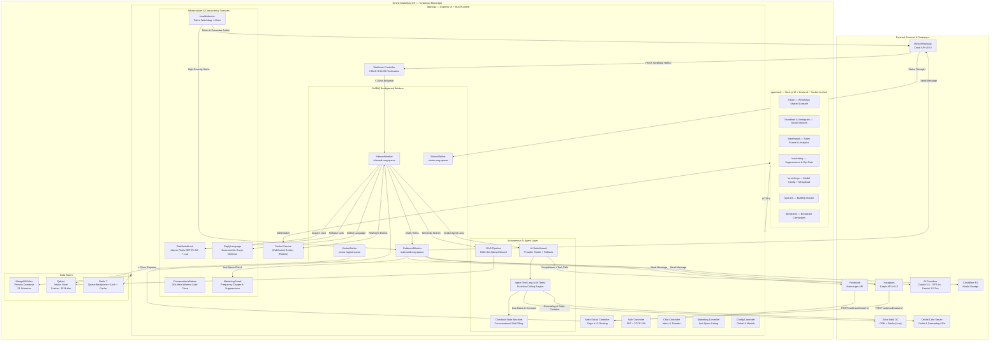

# System Architecture Diagram

```mermaid
graph TB
    subgraph External["External Services & Gateways"]
        META_WA["Meta WhatsApp\nCloud API v20.0"]
        META_FB["Facebook\nMessenger API"]
        META_IG["Instagram\nGraph API v21.0"]
        ZOHO["Zoho India DC\nCRM + Books (Live)"]
        LLM["AI Providers\nClaude 3.5 · GPT-4o · Gemini 1.5 Pro"]
        R2["Cloudflare R2\nMedia Storage"]
        DRISHTI_CORE["Drishti Core Server\nOrder & Geocoding APIs"]
    end

    subgraph Monorepo["Drishti Marketing OS — Turborepo Monorepo"]
        subgraph FE["apps/web — Next.js 16 + Zustand + Socket.io-client"]
            INBOX_PAGE["/inbox — WhatsApp Shared Console"]
            SOCIAL_PAGE["/facebook & /instagram — Social Inboxes"]
            DASH_PAGE["/dashboard — Sales Funnel & Analytics"]
            MKTG_PAGE["/marketing — Suppressions & Opt-Outs"]
            AI_PAGE["/ai-settings — Model Config + KB Upload"]
            Q_PAGE["/queues — BullMQ Monitor"]
            T_PAGE["/templates — Broadcast Campaigns"]
        end

        subgraph BE["apps/api — Express v5 + Bun Runtime"]
            WH["Webhook Controller\nHMAC-SHA256 Verification"]
            META_WH["Meta Social Controller\nPage & IG Routing"]
            AUTH_C["Auth Controller\nJWT + TOTP 2FA"]
            CHAT_C["Chat Controller\nInbox & Threads"]
            MKTG_C["Marketing Controller\nAnti-Spam Gating"]
            CONFIG_C["Config Controller\nGlobal & Models"]

            subgraph CORE["Infrastructure & Concurrency Services"]
                LOCK["DistributedLock\nAtomic Redis SET PX NX + Lua"]
                HEALTH["HealthMonitor\nToken Watchdog + Alerts"]
                WINDOW["ConversationWindow\n24h Meta Window Auto-Close"]
                LANG["ReplyLanguage\nDeterministic Script Detector"]
                MGUARD["MarketingGuard\nFrequency Capper & Suppressions"]
            end

            subgraph WORKERS["BullMQ Background Workers"]
                IW["InboundWorker\ninbound-msg-queue"]
                OW["OutboundWorker\noutbound-msg-queue"]
                VW["VectorWorker\nvector-ingest-queue"]
                SW["StatusWorker\nstatus-msg-queue"]
            end

            subgraph AI["Autonomous AI Agent Layer"]
                RAG["RAG Pipeline\n1536-dim Qdrant Search"]
                SWITCH["AI Switchboard\nProvider Router + Fallback"]
                TOOLS["Agent Tool Loop (x26 Tools)\nFunction-Calling Engine"]
                CHECKOUT["Checkout State Machine\nConversational Slot-Filling"]
            end

            SOCK["Socket Service\nWebSocket Emitter (Rooms)"]
        end

        subgraph DS["Data Stores"]
            MONGO["MongoDB Atlas\nPrimary Database\n23 Schemas"]
            QDRANT["Qdrant\nVector Store\nCosine · 1536-dim"]
            REDIS["Redis 7\nQueue Backplane + Lock + Cache"]
        end
    end

    %% Webhook Flows
    META_WA -->|"POST /webhook HMAC"| WH
    META_FB -->|"POST /webhook/meta/:id"| META_WH
    META_IG -->|"POST /webhook/meta/:id"| META_WH
    WH & META_WH -->|"< 20ms Enqueue"| IW

    %% Worker Execution
    IW -->|"Acquire Lock"| LOCK
    IW -->|"Detect Language"| LANG
    IW -->|"Semantic Search"| RAG --> QDRANT
    IW -->|"Invoke Agent Loop"| SWITCH
    SWITCH --> TOOLS
    TOOLS -->|"Live Deals & Contacts"| ZOHO
    TOOLS -->|"Geocoding & Order Creation"| DRISHTI_CORE
    TOOLS --> CHECKOUT
    SWITCH -->|"Completions + Tool Calls"| LLM
    IW -->|"Release Lock"| LOCK

    %% Outbound Flows
    IW -->|"Draft / Send"| OW
    OW -->|"Anti-Spam Check"| MGUARD
    OW -->|"Send Message"| META_WA & META_FB & META_IG
    OW --> R2
    IW -->|"Real-time Events"| SOCK

    %% Background Ingestion & Status
    VW --> QDRANT
    META_WA -->|"Status Receipts"| SW

    %% Storage Links
    BE <--> MONGO
    BE <--> REDIS
    FE <-->|HTTP API| BE
    FE <-->|WebSocket| SOCK

    %% Proactive Watchdog
    HEALTH -->|"Token & Geocoder Audits"| META_WA
    HEALTH -->|"High-Severity Alerts"| OW
```
