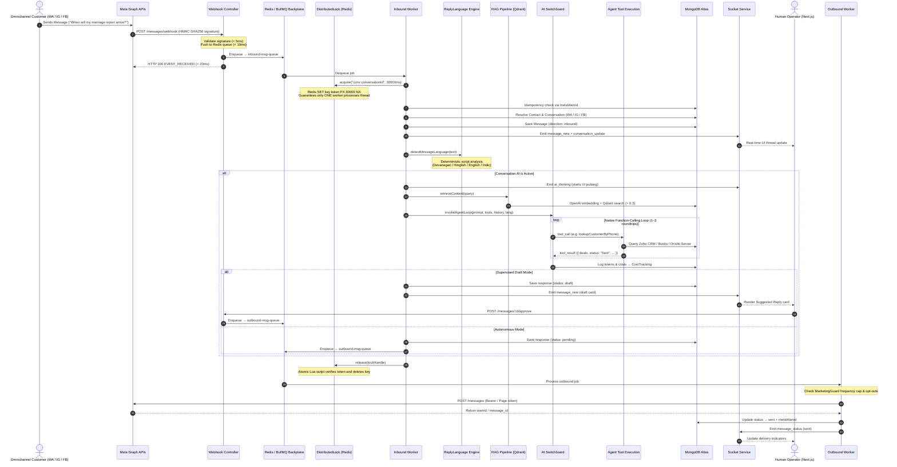
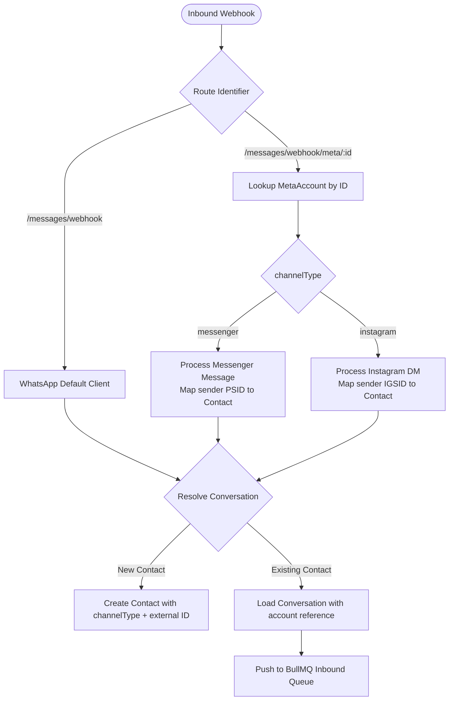
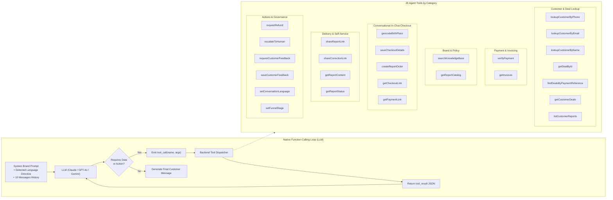
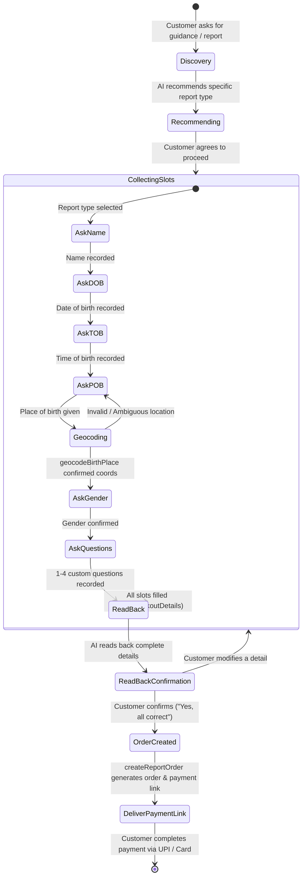
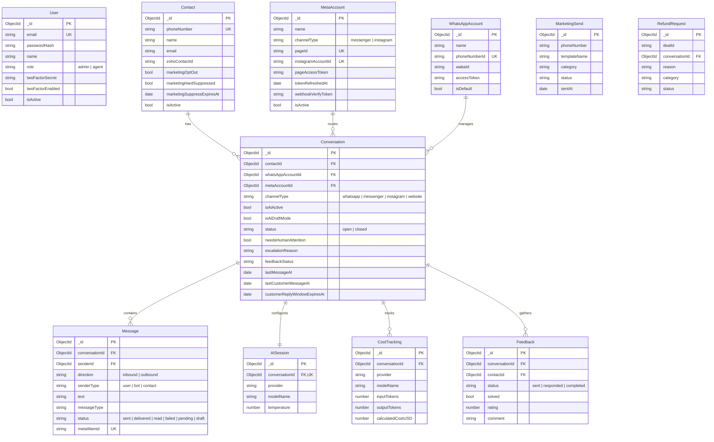
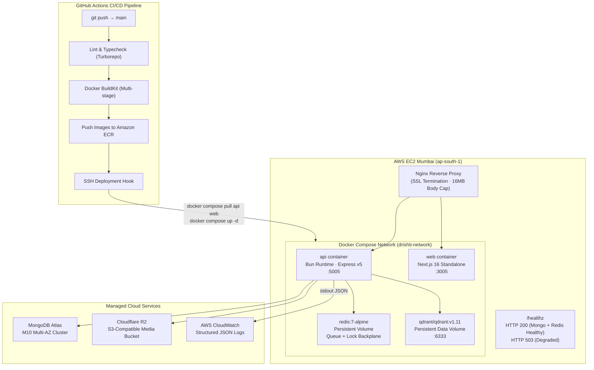

# System Architecture

> **Disclaimer**: This repository is a technical case study. The original implementation is proprietary and owned by the employer. No confidential source code, credentials, or sensitive business information is included.

---

## 1. High-Level System Architecture

The system is structured as a **Turborepo monorepo** containing two main applications — a Next.js 16 web frontend and a Bun/Express API backend — backed by three data stores (MongoDB Atlas, self-hosted Qdrant, Redis) and integrated with Meta's Omnichannel Cloud APIs (WhatsApp Cloud API v20.0, Facebook Messenger, Instagram Graph API v21.0), Zoho's India DC APIs (CRM and Books), and the Drishti core server.

```mermaid
graph TB
    subgraph External["External Services & Gateways"]
        META_WA["Meta WhatsApp\nCloud API v20.0"]
        META_FB["Facebook\nMessenger API"]
        META_IG["Instagram\nGraph API v21.0"]
        ZOHO["Zoho India DC\nCRM + Books (Live)"]
        LLM["AI Providers\nClaude 3.5 · GPT-4o · Gemini 1.5 Pro"]
        R2["Cloudflare R2\nMedia Storage"]
        ECR["Amazon ECR\nContainer Registry"]
        DRISHTI_CORE["Drishti Core Server\nOrder & Geocoding APIs"]
    end

    subgraph Monorepo["Drishti Marketing OS — Turborepo Monorepo"]
        subgraph Frontend["apps/web — Next.js 16 (App Router + Standalone)"]
            LOGIN["/login\nAuth + TOTP 2FA"]
            INBOX["/inbox\nWhatsApp Shared Inbox"]
            SOCIAL_INBOX["/facebook & /instagram\nSocialInboxLayout"]
            DASH["/dashboard\nSales Funnel & Analytics"]
            MARKETING_UI["/marketing\nOpt-Outs & Suppressions"]
            AISETTINGS["/ai-settings\nModel Config + RAG KB"]
            QUEUES["/queues\nBullMQ Monitor"]
            TEMPLATES["/templates\nBroadcast Campaigns"]
        end

        subgraph Backend["apps/api — Express v5 + Bun Runtime"]
            WH["Webhook Controller\nHMAC Signature Gate"]
            META_WH["Meta Social Webhook\nFB / IG Routing"]
            AUTH["Auth Controller\nJWT + 2FA TOTP"]
            CHAT["Chat Controller\nInbox & Thread API"]
            MKTG["Marketing Controller\nAnti-Spam & Gating"]
            ANALYTICS["Analytics Controller\nFunnel & Cost Engine"]
            MEDIA["Media Controller\n16MB Upload + R2 Presign"]

            subgraph CoreServices["Infrastructure & Concurrency Services"]
                LOCK["DistributedLock\nRedis SET PX NX + Lua"]
                HEALTH["HealthMonitor\nToken Watchdog + Alerts"]
                WINDOW["ConversationWindow\n24h Meta Window Auto-Close"]
                LANG["ReplyLanguage\nDeterministic Script Detector"]
                MGUARD["MarketingGuard\nFrequency Capper & Suppressions"]
            end

            subgraph Queues["BullMQ Background Workers"]
                IQ["inbound-msg-queue\nInboundWorker"]
                OQ["outbound-msg-queue\nOutboundWorker"]
                VQ["vector-ingest-queue\nVectorWorker"]
                SQ["status-msg-queue\nStatusWorker"]
            end

            subgraph AILayer["Autonomous AI Agent Layer"]
                RAG["RAG Pipeline\nSentence-Aware Qdrant Search"]
                SWITCH["AI Switchboard\nProvider Router & Fallbacks"]
                TOOLS["Agent Tool Loop (x26 Tools)\nFunction-Calling Engine"]
                CHECKOUT["Checkout State Machine\nIn-Chat Slot-Filling"]
            end

            SOCKET["Socket Service\nRoom-Targeted WebSocket"]
        end

        subgraph DataStores["Data Stores"]
            MONGO["MongoDB Atlas\nPrimary Database\n23 Schemas"]
            QDRANT["Qdrant Vector DB\n1536-dim Cosine\ndrishti-knowledge"]
            REDIS["Redis 7\nQueue Backplane\n+ Lock + Cache"]
        end
    end

    %% Inbound Ingress
    META_WA -->|"POST /messages/webhook\nHMAC Signed"| WH
    META_FB -->|"POST /messages/webhook/meta/:id"| META_WH
    META_IG -->|"POST /messages/webhook/meta/:id"| META_WH

    WH -->|"Enqueue & ack < 2s"| IQ
    META_WH -->|"Enqueue & ack < 2s"| IQ

    %% Worker Execution & Concurrency
    IQ -->|"Acquire lock (conv:ID)"| LOCK
    IQ -->|"Detect Script"| LANG
    IQ -->|"Semantic retrieval"| RAG
    IQ -->|"Invoke agent loop"| SWITCH
    SWITCH --> TOOLS
    TOOLS -->|"Live contact/deal"| ZOHO
    TOOLS -->|"Geocode & order"| DRISHTI_CORE
    TOOLS --> CHECKOUT
    SWITCH -->|"Completions + tools"| LLM
    IQ -->|"Release lock (Lua)"| LOCK

    %% Outbound & Queues
    IQ -->|"Emit events"| SOCKET
    IQ -->|"Enqueue reply"| OQ
    OQ -->|"Frequency check"| MGUARD
    OQ -->|"POST /messages"| META_WA
    OQ -->|"POST /messages"| META_FB
    OQ -->|"POST /messages"| META_IG
    VQ -->|"Upsert vectors"| QDRANT

    %% Frontend Connections
    INBOX <-->|"HTTP / Cookie Auth"| CHAT
    INBOX <-->|"WebSocket"| SOCKET
    SOCIAL_INBOX <-->|"HTTP + WebSocket"| CHAT
    DASH -->|"GET /analytics"| ANALYTICS
    MARKETING_UI -->|"GET /marketing"| MKTG

    %% Proactive Health & Alerts
    HEALTH -->|"Audit tokens"| META_WA
    HEALTH -->|"Warn / Alert WhatsApp"| OQ

    %% Data Store Bindings
    Backend <-->|"Mongoose ODM"| MONGO
    RAG <-->|"REST Client"| QDRANT
    LOCK <-->|"ioredis"| REDIS
    Backend <-->|"ioredis"| REDIS
```



---

## 2. Inbound Message Lifecycle & Concurrency Flow

Every inbound message (WhatsApp, Messenger, or Instagram) traverses a 9-layer pipeline designed for sub-2s acknowledgement, distributed concurrency locking, script fidelity, and autonomous tool-driven response generation.



---

## 3. Omnichannel Multi-Account Routing

To support multiple WhatsApp Business Accounts (WABAs), Facebook Pages, and Instagram Business profiles within a single tenant without cross-contamination:



### Account Models
- **`WhatsAppAccount`**: Stores WABA ID, Phone Number ID, App Secret, and dedicated Access Tokens for multi-number setups.
- **`MetaAccount`**: Stores `channelType` (`messenger` | `instagram`), `pageId`, `instagramAccountId`, and Page/IG access tokens. Includes auto-refreshed timestamps for `IGAA` Instagram User tokens.

---

## 4. The 26-Tool Native AI Agent Architecture

Instead of prompt-stuffing with a static dump, the AI Switchboard exposes an autonomous **Tool-Calling Registry** (`agentTools.ts`):



---

## 5. Conversational In-Chat Checkout State Machine

A breakthrough capability in Drishti Marketing OS is **in-chat order booking**. Rather than redirecting users to an external website checkout where drop-offs occur, the AI collects details conversationally:



---

## 6. Proactive Health Monitoring & Token Lifecycle Watchdog

Silent failures (such as expired tokens or third-party geocoding API outages) cause AI responders to fail silently while remaining "active" in the UI. A background service monitors system vitals and proactively alerts operations:

```mermaid
graph TD
    CRON["Health Monitor Watchdog\n(Runs every 30 minutes)"] --> T1{Check Meta Access Tokens}
    T1 -->|Valid| T2{Inspect Expiry Date}
    T1 -->|Code 190 Invalid| ALERT1[Trigger P1 WhatsApp Alert to Admins]
    T2 -->|< 7 Days Remaining| ALERT2[Trigger Warning WhatsApp Alert]
    T2 -->|Instagram Token > 20 Days| REFRESH[Auto-refresh IGAA Token\n(via Graph API)]

    CRON --> G1{Check Geocoder Service}
    G1 -->|Probe Fails| ALERT3[Trigger P2 WhatsApp Alert]

    ALERT1 & ALERT2 & ALERT3 --> SEND_ALERT["Outbound Dispatch via\nMeta-Approved web_error_alert Template"]
```

---

## 7. Database Relationship Diagram (MongoDB Atlas)

The platform is backed by 23 Mongoose collection schemas designed for high-concurrency messaging, state tracking, and auditing:



---

## 8. Deployment Architecture (AWS EC2 & Docker Compose)


