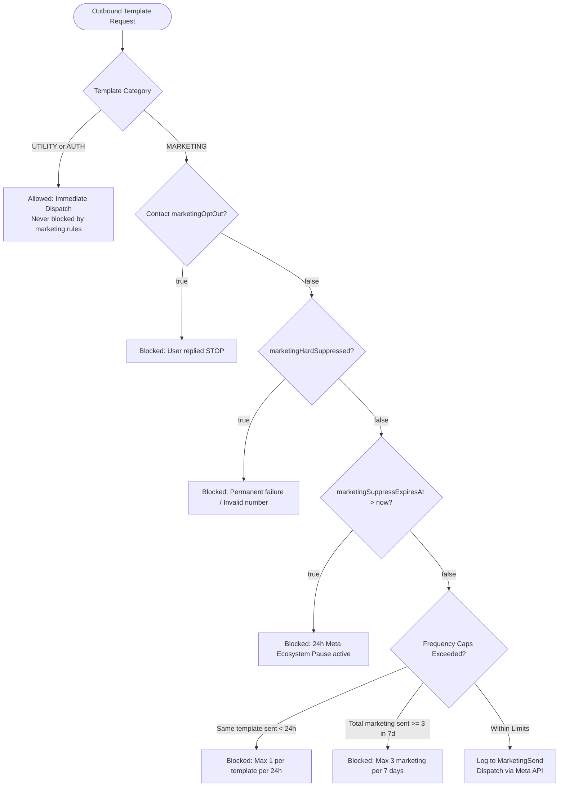

# System Design Deep-Dive

> **Disclaimer**: This repository is a technical case study. The original implementation is proprietary and owned by the employer. No confidential source code, credentials, or sensitive business information is included.

---

## 1. Problem Statement

A high-volume consumer astrology business relied on a third-party WhatsApp BSP (Business Service Provider) that charged recurring per-agent monthly subscriptions and provided no custom AI capabilities. Support response times averaged **4–12 hours**, conversion drop-offs occurred on external web redirect links, and there was no way to inject the company's proprietary knowledge base or sync real-time CRM deal states across WhatsApp, Facebook, and Instagram.

**Core Design Goals:**
- **Eliminate BSP subscription fees** by integrating directly with Meta's Omnichannel Graph APIs (WhatsApp, Messenger, Instagram).
- **Reduce median response time to < 30 seconds** with autonomous multi-provider AI auto-responders.
- **Support in-chat conversational checkout** to collect birth details and generate orders without dropping off to external websites.
- **Guarantee zero duplicate responses & race conditions** via atomic distributed locking on rapid customer message bursts.
- **Enforce strict marketing guardrails** (frequency caps, STOP opt-out compliance, tiered delivery failure suppressions).
- **Prevent silent platform outages** via proactive health monitors and token auto-renewal watchdog loops.
- **Track end-to-end sales attribution** across WhatsApp, Facebook Messenger, and Instagram Direct.

---

## 2. Architecture Philosophy

### Async-First Ingestion with Sub-2s Boundary
Meta Cloud APIs enforce a hard **2-second webhook timeout**. If a webhook does not return HTTP 200 within 2000ms, Meta marks delivery as failed and retries, creating severe risk of duplicate message processing.

**Design**: The Express webhook controller acts purely as a non-blocking ingestion gate:
1. Constant-time HMAC-SHA256 signature verification (< 5ms).
2. Instant Redis enqueueing to `inbound-msg-queue` (< 10ms).
3. Immediate return of `HTTP 200 EVENT_RECEIVED` (< 20ms total).

All business processing (contact lookup, thread creation, RAG semantic search, LLM tool execution, CRM sync, database writes, and outbound dispatches) is fully decoupled into BullMQ background workers.

### Distributed Concurrency & Locking
Customers frequently send rapid sequences of messages within seconds (e.g. "Hi", "Are you there?", "I want to check my marriage Kundli"). In an asynchronous queue worker pool, these messages could be picked up concurrently by multiple worker threads, resulting in duplicate AI inferences, conflicting order states, and overlapping replies.

**Solution**: Redis-backed **Atomic Distributed Locking** (`DistributedLock`):
- Before processing an inbound message for a conversation, the worker attempts an atomic Redis lock:
  ```
  SET lock:conv:{conversationId} {uuidToken} PX 30000 NX
  ```
- If the lock is already held by another worker, the concurrent job is dropped or deferred.
- Lock release uses an atomic Lua script that verifies the token before deletion:
  ```lua
  if redis.call("get", KEYS[1]) == ARGV[1] then
    return redis.call("del", KEYS[1])
  else
    return 0
  end
  ```
- This guarantees **single-threaded serial execution per conversation** across distributed worker processes.

---

## 3. Database Design & Schemas

### MongoDB Atlas — Primary State & Entity Store

MongoDB handles semi-structured omnichannel payloads, conversation states, and audit trails across 23 Mongoose schemas:

#### High-Performance Indexing Strategy

| Collection | Index | Purpose |
|-----------|-------|---------|
| `Contact` | `{ phoneNumber: 1 }` unique | WhatsApp identity lookup on ingress |
| `Contact` | `{ email: 1 }` | Secondary account & Zoho Books lookup |
| `MetaAccount` | `{ pageId: 1 }` unique | Routing Facebook Messenger webhooks |
| `MetaAccount` | `{ instagramAccountId: 1 }` unique sparse | Routing Instagram Direct webhooks |
| `Conversation` | `{ channelType: 1, lastMessageAt: -1 }` compound | Satisfies inbox list filter + sort in single index scan |
| `Conversation` | `{ whatsAppAccountId: 1, lastMessageAt: -1 }` compound | Multi-WABA inbox filter & sorting |
| `Conversation` | `{ metaAccountId: 1, lastMessageAt: -1 }` compound | Social inbox account filter & sorting |
| `Conversation` | `{ customerReplyWindowExpiresAt: 1 }` | Efficient background query for expired 24h Meta sessions |
| `Message` | `{ metaWamid: 1 }` unique sparse | Idempotency — rejects duplicate Meta webhook retries |
| `Message` | `{ conversationId: 1, createdAt: -1 }` compound | Fast thread message retrieval |
| `MarketingSend` | `{ phoneNumber: 1, templateName: 1, sentAt: -1 }` compound | Real-time frequency cap evaluation |
| `CostTracking` | `{ createdAt: 1, provider: 1 }` compound | Real-time token spend trend aggregations |
| `Feedback` | `{ conversationId: 1 }` | Fast CSAT survey resolution |

---

## 4. Anti-Spam Marketing Guardrails (`MarketingGuard`)

WhatsApp enforces strict template quality ratings. Spreading unconstrained marketing messages risks template pausing or business account bans. `MarketingGuard` intercepts all outbound messages:



### Tiered Delivery-Failure Suppression
When Meta delivery status webhooks return `"failed"`, the error codes are classified:
1. **Permanent Suppression (`marketingHardSuppressed = true`)**:
   - Meta code `131050`: User opted out at the Meta OS level.
   - Meta code `131026`: Undeliverable / invalid phone number.
2. **Temporary 24h Suppression (`marketingSuppressExpiresAt = now + 24h`)**:
   - Meta code `131049`: Meta accepted then dropped the message "to maintain healthy ecosystem engagement" (the user received too many marketing messages across all brands).
   - **Critical Rule**: Pauses marketing for exactly 24 hours. Never blocks transactional order/payment messages.

---

## 5. Conversation Lifecycle & Meta 24-Hour Reply Window

Meta restricts free-form text messaging to within **24 hours of the customer's last inbound message**. Beyond 24 hours, businesses may only communicate using pre-approved paid Meta Templates.

### The Auto-Close Engine (`conversationWindow.ts`)
Leaving expired conversations in the "Open" inbox creates operator confusion and stale memory footprints. A dedicated background service manages window lifecycles:
- **Tracking**: Inbound messages record `lastCustomerMessageAt` and compute `customerReplyWindowExpiresAt = lastCustomerMessageAt + 24h`.
- **Auto-Close Service**: Runs every 60 seconds, processing expired conversations in batches of 500:
  - Closes threads whose 24h reply window has lapsed.
  - Clears stale `"needsHumanAttention"` flags on automated threads.
  - **Exception**: Keeps threads open past 24 hours *only* if `isAiActive === false` AND `needsHumanAttention === true` (a live human operator is actively working the escalation).
- **Graceful Reopening**: If a customer replies to a closed conversation, the inbound worker seamlessly transitions status to `"open"` and preserves previous AI configuration.

---

## 6. Deterministic Language & Script Detection Engine (`replyLanguage.ts`)

Leaving language choice to LLM inference produced severe issues: models frequently drifted from English into Hinglish or Devanagari Hindi simply because the customer had an Indian name or used a neutral greeting like "Hi".

### Code-Level Script Analysis
Instead of prompting the model to guess the language, `replyLanguage.ts` performs deterministic script analysis before the model is invoked:

1. **Non-Latin Scripts**: Regex script ranges detect Devanagari Hindi (`/[ऀ-ॿ]/`), Bengali, Punjabi, Gujarati, Odia, Tamil, Telugu, Kannada, Malayalam, and Urdu.
2. **Roman Hinglish Markers**: Matches distinct function words (`aap`, `kaise`, `kya`, `nahi`, `chahiye`, `hoga`, `batao`) as isolated word boundaries (`\b`), preventing false positives (e.g. `hai` inside "Shanghai").
3. **English Function Markers**: Distinct English functional words (`the`, `is`, `will`, `when`, `report`, `career`, `marriage`) identify true English intent.
4. **Neutral Token Filtering**: Single tokens like "Hi", "Hello", "OK", "👍", or time strings ("9:30 AM") carry zero linguistic signal and inherit the thread's established language.

The detected language directive is injected into the system prompt as an imperative constraint, guaranteeing strict language and script fidelity.

---

## 7. Native Function-Calling Tool Loop vs Prompt-Stuffing

| Dimension | Legacy Prompt-Stuffing | Native Function-Calling Loop (`agentTools.ts`) |
|-----------|------------------------|------------------------------------------------|
| **Architecture** | Guess customer data upfront & dump into prompt | LLM reasons about required data and invokes tools on demand |
| **Tool Count** | ~8 static prompts | 26 specialized native tools |
| **Data Freshness** | Pre-fetched snapshot (can be stale) | Live API call at time of reasoning |
| **Payment Verification**| Hallucinated confirmations based on text | `verifyPayment` queries CRM and Books systems of record |
| **Sensitive Links** | Pre-injected URLs risking exposure | Ownership check inside `shareReportLink` with loose name/DOB match |
| **Order Booking** | External web redirect link | Conversational slot-filling in chat (`saveCheckoutDetails`, `createReportOrder`) |
| **Token Efficiency** | Bloated prompts on every turn | Minimal base prompt; context added only when tools return data |

---

## 8. Sales Funnel & Multi-Channel Attribution Analytics

### Channel Attribution
To track revenue by marketing channel, every checkout and payment link generated by the AI includes dynamic UTM parameters:
- **WhatsApp**: `utm_source=whatsapp_chat&utm_medium=agent&utm_campaign=...`
- **Facebook Messenger**: `utm_source=facebook_chat&utm_medium=agent&utm_campaign=...`
- **Instagram Direct**: `utm_source=instagram_chat&utm_medium=agent&utm_campaign=...`

### Sales Funnel Stages
The platform visualizes conversion drop-offs across 7 distinct stages:
1. **Enquiry**: Inbound conversation opened.
2. **Understand (Stage 2)**: AI completes discovery and identifies the customer's core concern.
3. **Recommend (Stage 3)**: AI recommends a specific report.
4. **Add to Cart**: Conversational slots filled.
5. **Details Confirmed**: Customer validates read-back.
6. **Order Created**: Order generated in Drishti server.
7. **Payment Received**: Verified closed-won deal.

---

## 9. Observability & Proactive Health Watchdog

### Proactive Health Monitor (`healthMonitor.ts`)
Runs every 30 minutes to eliminate silent failure modes:
1. **Meta Access Token Health**: Validates tokens via `graph.facebook.com/debug_token`. Warns 7 days before token expiration.
2. **Instagram Token Auto-Renewal**: Automatically refreshes 60-day `IGAA` Instagram User access tokens at day 20 via Graph API.
3. **Geocoder API Health**: Probes place-of-birth geocoding services to ensure order checkout will not fail.
4. **WhatsApp Admin Alerts**: Immediately alerts engineering leads via Meta-approved `web_error_alert` WhatsApp templates upon detecting P1 outages.
